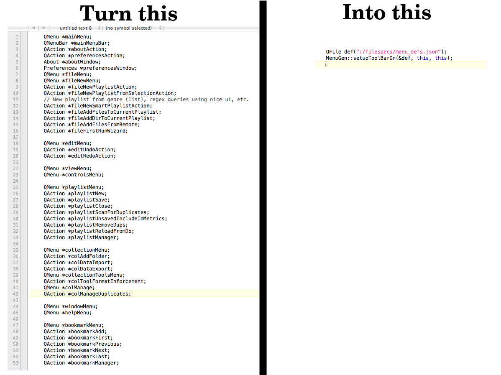

<!-- Improved compatibility of back to top link: See: https://github.com/othneildrew/Best-README-Template/pull/73 -->
<a name="readme-top"></a>
<!--
*** Thanks for checking out the Best-README-Template. If you have a suggestion
*** that would make this better, please fork the repo and create a pull request
*** or simply open an issue with the tag "enhancement".
*** Don't forget to give the project a star!
*** Thanks again! Now go create something AMAZING! :D
*** Will do.
-->


<!-- PROJECT LOGO -->
<br />
<div align="center">
  <h3 align="center">qt5menugen</h3>

  <p align="center">
    Library that builds out Menus and Toolbars for Windows, Linux and OS X using a JSON file
    <br />
    <br />
    <a href="https://github.com/NucleaPeon/qt5menugen/issues">Report Bug</a>
    ·
    <a href="https://github.com/NucleaPeon/qt5menugen/issues">Request Feature</a>
  </p>
</div>

<a href="https://github.com/NucleaPeon/qt5menugen">
    
</a>


<!-- TABLE OF CONTENTS -->
<details>
  <summary>Table of Contents</summary>
  <ol>
    <li>
      <a href="#about-the-project">About The Project</a>
      <ul>
        <li><a href="#built-with">Built With</a></li>
      </ul>
    </li>
    <li>
      <a href="#getting-started">Getting Started</a>
      <ul>
        <li><a href="#prerequisites">Prerequisites</a></li>
        <li><a href="#installation">Installation</a></li>
      </ul>
    </li>
    <li><a href="#usage">Usage</a></li>
    <li><a href="#knownissues">Known Issues</a></li>
    <li><a href="#roadmap">Roadmap</a></li>
    <li><a href="#contributing">Contributing</a></li>
    <li><a href="#license">License</a></li>
    <li><a href="#contact">Contact</a></li>
  </ol>
</details>


<!-- ABOUT THE PROJECT -->
## About The Project
``qt5menugen``: Generate Mac OSX, Windows and Linux -specific toolbars and menus via a json file.

Instead of having many QMenu and QAction declarations in your qt5 c++ header files, this library automates all ``QMenu``, ``QToolBar`` and ``QAction`` initialization based on the contents of a JSON file.


### Using in your CMake Project

In the recent v2.0.3 release, we now support ``find_package()`` as a way to determine package version.

To use within a CMake file:

```
    find_package(qt5menugen CONFIG REQUIRED 2.0.3)

    ...

    target_link_libraries(${PROJECT_NAME} qt5menugen)
```

### Quickstart

Using this library requires that you:

* Have a .json file included in your project that abides by the specification (TODO, see existing json files in ``example/`` folder and later, the appropriate documentation).
* Construct the QtMenuGen object and call ``setup()`` on it.

**How To Initialize:**

```
    #include <qt5menugen.h>

    class QWidget/QMainWindow ...
    ...

    {
        QtMenuGen menugen = new QtMenuGen(":/menu.json");
        menugen->setup(this, this);
    }

```

*QtMenuGen can take a QUrl or a QString path. The ":" denotes a path from a Qt Resource file.*

A simple example is having a .json file that sets up a QAction that closes the application.

```
[
    {
        "name": "&File",
        "actions": [
                {
                "name": "quit",
                "text": "&Quit",
                "toolbar_hidden": true,
                "shortcut": "Ctrl+Q",
                "icon": ":/icons/dialog-close.png",
                "slot": "close()",
                "comment": "This will be applied to mac osx application menu automatically."
            },
        ]
    }
]
```

**Building Documentation:**

```
    doxygen Doxyfile
```


On OS X, if you have Doxygen installed as an application in ``/Applications``, try this from the ``qt5menugen`` directory:

```
    /Applications/Doxygen.app/Contents/Resources/doxygen Doxyfile
```

Documentation will be placed in the ``docs/`` directory in latex and html formats.

### Additional Details


**SLOTS**

QActions will call a slot on the ``triggered()`` event. Slots are handled by writing out the method name including parens as a string in the json file, then expecting that method to be on the object that contains the toolbar/menus.

Toolbars and Menus are supported on ``QWidget``'s and ``QMainWindow``'s.

Essentially ``"slot": "close()"`` calls the mainwindow's close() slot (it already exists) and so this handles icon/shortcut/QAction/QMenu and if desired, a ``QToolBar`` item (``QAction`` or ``QMacToolBarItem``).

**SHORTCUTS**

Shortcuts can either be a string of Key names and ``+`` to append them.
Example: ``Ctrl+P`` for a print shortcut, but recommended to use "QKeySequence::Print" instead because it is more readable. OS X Command shortcuts are already transposed; Ctrl+P = Command+P so there's no need to print out the native name of mac particulars.

QtMenuGen supports utilizing ``StandardKey`` enum shortcuts. for better multiplatform handling and is recommended to use these first. See the QKeySequence Qt documentation for a list, or check qt5menugen.cpp for the
QMap we use to handle enum key loookup.


### Oxygen Icon Licensing

This project includes Oxygen Icons <a href="https://techbase.kde.org/Projects/Oxygen/Licensing">https://techbase.kde.org/Projects/Oxygen/Licensing</a> which are licensed under the LGPL v3 (see LICENSE-LGPL3 file). All files under this license are located in the ``example/ExampleWindow/*.png`` directory.

<p align="right">(<a href="#readme-top">back to top</a>)</p>

### Built With

This project is built on a minimum Qt5 version of Qt 5.3.2. For OS X 10.6.8, you can download the Qt5 binary at my <a href="https://github.com/NucleaPeon/qt5-sle/releases/tag/v5.3.2">other repository</a>.

It is also tested using Qt5.15 on Linux amd64.

<p align="right">(<a href="#readme-top">back to top</a>)</p>


<!-- GETTING STARTED -->
## Getting Started

Clone the repo:

```sh
    git clone https://github.com/NucleaPeon/qt5menugen.git
```


### Prerequisites

You will need:
* git
* cmake (for CMake builds)
* clang >= 3 OR g++ >= 4.2 OR msvc
* make (OS X and Linux)
* Qt5 >= 5.3.2 (Though 5.3.1 **may** also be acceptable)
* For Windows 7:
	* Visual Studio with MSBuild.exe on your ``PATH`` (I'm using VS 2013)
	* Windows Driver Version kit (I'm using 7.1.0)
	* Git Bash is useful for cli builds
	* Ensure that Qt5_DIR environmental variable is set to something like ``C:\Qt\Qt5.3.1\5.3\msvc2013_opengl`` or ``C:\Qt\Qt5.3.2\5.3\msvc2013_64_opengl``
	* Ensure your path to windeployqt is on ``PATH`` (``C:\Qt\Qt5.3.1\5.3\msvc2013_opengl\Bin``)


### Installation

**Note** I recommend calling ``make -jN`` where ``N`` is the number of cores of your cpu.

<hr>

* Using cmake on Linux or Mac:

  ```sh
      cd build/
      cmake -DCMAKE_INSTALL_PREFIX=/usr/ ..
      make -j2
      sudo make install
  ```

* For Windows 7 on Visual Studio 2013


TODO
<!--
	```sh
	cd build
	cmake ..
	# Define Debug or Release for build type. "//" to specify an option is required for git bash, but only "/" for cmd.exe or powershell.
	MSBuild.exe qJsonify.sln //p:Configuration="Debug"
	windeployqt Debug/QJsonify.exe
	```
Compress the Release/ or Debug/ directory and distribute.
  -->


## Usage

Once the library is installed, you can access it via qmake by including this code after the ``add_executable()`` command:

```cmake
  target_link_libraries(${PROJECT_NAME} Qt5::Widgets qt5menugen)
```

See the included ``example/`` project for including it in a project.

**Currently have only built this as a dynamic/shared library; library must be installed before this will succeed.**

```sh
  cd example/ExampleWindow/build
  cmake ..
  make
  ./examplewindow
```

<p align="right">(<a href="#readme-top">back to top</a>)</p>

## Known Issues

* This library contains its own pkgconfig .pc file to allow find_package() to function. By default, it will be installed to ``/usr/local/share/pkgconfig`` even on OSX. It's possible that OSX expects /usr/lib/pkgconfig, so either use ``-DCMAKE_INSTALL_DATAROOTDIR="usr/lib"``. If this affects you, file an issue. It may be better to manually configure APPLE systems to use different directories.

<p align="right">(<a href="#readme-top">back to top</a>)</p>

<!-- ROADMAP -->
## Roadmap

- [ ] Improve documentation
- [ ] Allow QUrl's to be passed in, even if it means converting them to QFile and not allowing remote files to be used.
- [ ] Add/release static versions or include instructions and qt5 5.3.2 statically compiled binaries
- [ ] Create a debian release package
- [ ] Create a gentoo guru ebuild
- [ ] Automatic testing, especially of shortcut resolution (multiple shortcuts and their int result values), use || to enable multiple shortcuts for one action (esp. when a shortcut is specific to one platform/OS)

<p align="right">(<a href="#readme-top">back to top</a>)</p>

<!-- CONTRIBUTING -->
## Contributing

Contributions are what make the open source community such an amazing place to learn, inspire, and create. Any contributions you make are **greatly appreciated**.

Please remember to avoid any c++11 code and any Qt 5.4.0+ introduced functions should have Qt 5.3.2 versions defined for Snow Leopard compatibility.

If you have a suggestion that would make this better, either create an issue with your idea(s) or fork the repo and create a pull request.

Don't forget to give the project a star! Thanks again!

<p align="right">(<a href="#readme-top">back to top</a>)</p>


<!-- LICENSE -->
## License

Distributed under the GPL v2.0 License. See `LICENSE` for more information.

I am purposefully using a more liberal GNU License for libraries to encourage adoption.

<p align="right">(<a href="#readme-top">back to top</a>)</p>


<!-- CONTACT -->
## Contact

You can email me at <initial.dann@gmail.com>.

[https://github.com/NucleaPeon](https://github.com/NucleaPeon)

Thanks to the <a href="https://github.com/othneildrew/Best-README-Template">https://github.com/othneildrew/Best-README-Template</a> project for helping me get started on this README.md.

<p align="right">(<a href="#readme-top">back to top</a>)</p>

<!-- MARKDOWN LINKS & IMAGES -->
<!-- https://www.markdownguide.org/basic-syntax/#reference-style-links -->

